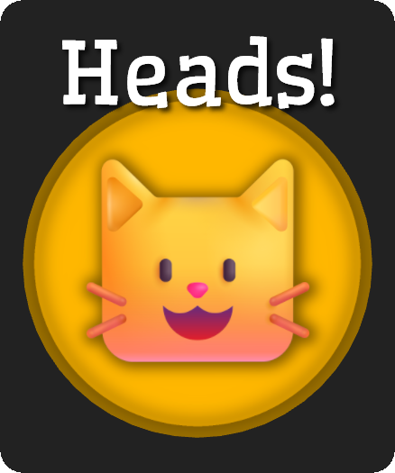

# [Turn Timer + Coin Flip](https://flip.pana.moe/)

A simple turn timer with a coin flip function, designed to be used on a device placed between the players. Tracks the current time taken by the player on their turn and the total time taken by a player across the current session. 

Tap on the green button or the time display to start the timer for that player. Tapping on the opposing button/time display will switch to tracking that player's time. When the timer is active, the current player's button will change a red pause button enabling that player to pause their timer. Fullscreen button (purple) to the left of the center clock, reset button (orange) to the right of the center clock. Settings accessible from the gear icon near the bottom-center.

The background glow on the active player's side will change colors after their turn has exceeded a configurable amount of time - by default, 2 minutes.

Optionally, sounds can be played at fixed intervals during a player's turn - off by default.

## TODO:
- Customizable sounds, colors, images, turn timeouts/indicators (e.g. elapsed time to change color).
- Confirmation on reset.
- Add display for the history of coin flips during the current session.
- Write to localstorage to survive page refresh.

# Credits
Audio used:
- [synth texture 02.mp3 by nomiqbomi](https://freesound.org/s/578383/) / License: CC0
- [Kalimba (C-note) by foochie_foochie](https://freesound.org/people/foochie_foochie/sounds/331047/) / License: CC0
- [Coin Flip - 4 by SpaceJoe](https://freesound.org/people/SpaceJoe/sounds/485727/) / License: CC0
- [Debussy - Clair de Lune - L 75 by GregorQuendel](https://freesound.org/s/713544/) / License: Attribution NonCommercial 4.0

Coin images from [Microsoft's FluentUI](https://github.com/microsoft/fluentui-emoji/) emoji set, MIT license.
