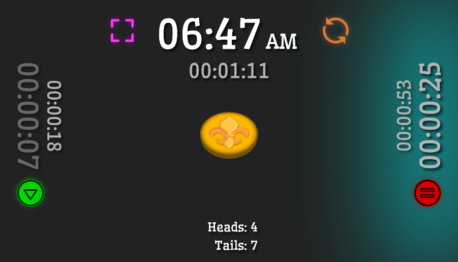

# [Turn Timer + Coin Flip](https://vs-w.github.io/coin-flip-turn-timer/)

A simple turn timer with a coin flip function, designed to be used on a device placed between the players. Tracks the current time taken by the player on their turn and the total time taken by a player across the current session. 

Tap on the green button or the time display to start the timer for that player. Tapping on the opposing button/time display will switch to tracking that player's time. When the timer is active, the current player's button will change a red pause button enabling that player to pause their timer. Fullscreen button (purple) to the left of the center clock, reset button (orange) to the right of the center clock.

## TODO:
- Darken time for inactive player.
- Add a history coin flips, plus total count of each outcome.
- Adapt font size for really small screens.
- Confirmation on reset.
- Write to localstorage to survive page refresh.
